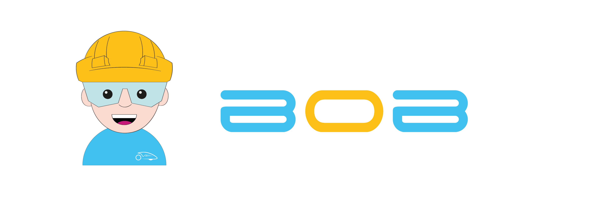

<h3 align="center">
Il factotum della bici

 
 

<!-- ALL-CONTRIBUTORS-BADGE:START - Do not remove or modify this section -->

<!-- ALL-CONTRIBUTORS-BADGE:END -->

</h3>

- BOB is not a single program, it is a collection of independent modules and tools to manage them.
- Modules talk to each other through MQTT.
- Up to now, all the modules are written in Python and are managed by systemd.
- Every module has its own systemd service, and it's independent of the others.

## CLI

In order to ease the management of the modules, BOB has a command line interface.\
Read the [README](bobcli/README.md) to know how to use it.

## Contributors ✨

Thanks goes to these wonderful people ([emoji key](https://allcontributors.org/docs/en/emoji-key)):

<!-- ALL-CONTRIBUTORS-LIST:START - Do not remove or modify this section -->
<!-- prettier-ignore-start -->
<!-- markdownlint-disable -->
<table>
  <tr>
    <td align="center"><a href="https://github.com/stelosca96"> <b>Stefano Loscalzo</b></a> <a href="https://github.com/policumbent/bob/commits?author=stelosca96" title="Code">💻</a> <a href="#ideas-stelosca96" title="Ideas, Planning, & Feedback">🤔</a> <a href="#infra-stelosca96" title="Infrastructure (Hosting, Build-Tools, etc)">🚇</a></td>
    <td align="center"><a href="https://github.com/davidegavatorta"> <b>davidegavatorta</b></a> <a href="https://github.com/policumbent/bob/commits?author=davidegavatorta" title="Code">💻</a></td>
    <td align="center"><a href="https://github.com/CornagliaRiccardo"> <b>CornagliaRiccardo</b></a> <a href="https://github.com/policumbent/bob/commits?author=CornagliaRiccardo" title="Code">💻</a></td>
    <td align="center"><a href="https://github.com/AlbertoEusebio"> <b>Alberto Eusebio</b></a> <a href="https://github.com/policumbent/bob/commits?author=AlbertoEusebio" title="Code">💻</a></td>
    <td align="center"><a href="http://www.davideaimar.com"> <b>davide.aimar</b></a> <a href="https://github.com/policumbent/bob/commits?author=davideaimar" title="Code">💻</a> <a href="#maintenance-davideaimar" title="Maintenance">🚧</a> <a href="#ideas-davideaimar" title="Ideas, Planning, & Feedback">🤔</a></td>
    <td align="center"><a href="http://gabelluardo.github.io"> <b>Gabriele Belluardo</b></a> <a href="#design-gabelluardo" title="Design">🎨</a> <a href="#infra-gabelluardo" title="Infrastructure (Hosting, Build-Tools, etc)">🚇</a> <a href="https://github.com/policumbent/bob/commits?author=gabelluardo" title="Tests">⚠️</a> <a href="https://github.com/policumbent/bob/commits?author=gabelluardo" title="Documentation">📖</a></td>
  </tr>
</table>

<!-- markdownlint-restore -->
<!-- prettier-ignore-end -->

<!-- ALL-CONTRIBUTORS-LIST:END -->

This project follows the [all-contributors](https://github.com/all-contributors/all-contributors) specification. Contributions of any kind welcome!
